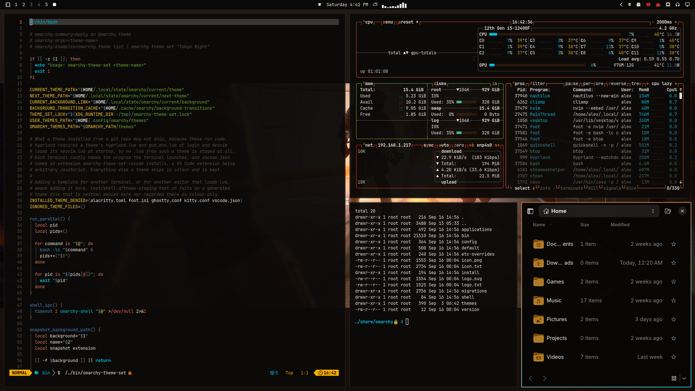
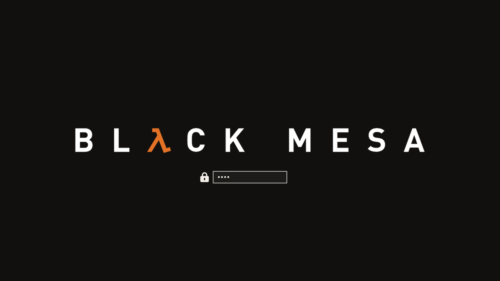

# HEV Suit — Omarchy theme

Incident report, unclassified: Freeman never clocked in for the usual Tuesday.
Somewhere between the tram ride and the HEV bay he found a compositor called
**Hyprland**, an opinionated Arch called **Omarchy**, and a terminal that
answered in hazard orange. The resonance cascade still happened — of course it
did — but the desktop held. Facility black. Blueprint cyan on the monitors.
Active Hypr borders run a 45° **HEV-orange → blueprint-cyan** gradient
(same dual-accent trick as the asphalt night pack). Same story, better rice.

Orange-suit theme for [Omarchy](https://omarchy.org/). Inspired by the look of
*Black Mesa* / *Half-Life* — **not affiliated with Valve or Crowbar Collective**
(see [Credits](#credits--legal-ish) below).

Adjacent, different vibe:
[Shiver-dev01/omarchy-black-mesa-theme](https://github.com/Shiver-dev01/omarchy-black-mesa-theme)
is an **amber phosphor CRT** “Black Mesa” take (single facility-amber accent,
scanline wallpapers). This pack is the *game* — HEV orange, blueprint cyan,
Steam art, corridor zombies and all. Same building, different wing.

Omarchy derives the install folder from the repo name (`omarchy-…-theme` →
slug). A plain `black-mesa` slug would collide with that CRT pack — `theme
install` **deletes** the existing folder first — so this one ships as **HEV
Suit** (`omarchy-hev-suit-theme` → `hev-suit`) and they can coexist.

<p align="center">
  
</p>





## Install

```bash
omarchy theme install https://github.com/AlxWolfenstein97/omarchy-hev-suit-theme.git
# optional — About + screensaver ASCII for this theme (skippable; see Branding)
cp ~/.config/omarchy/themes/hev-suit/about.txt ~/.config/omarchy/branding/about.txt
cp ~/.config/omarchy/themes/hev-suit/screensaver.txt ~/.config/omarchy/branding/screensaver.txt
```

That clones **and** applies the theme (`omarchy-theme-set` runs inside
`theme install`). Do **not** follow with another `omarchy theme set` — a second
set skips the first wallpaper and just wastes a switch.

Or clone into place (then you *do* need an explicit set):

```bash
git clone https://github.com/AlxWolfenstein97/omarchy-hev-suit-theme.git ~/.config/omarchy/themes/hev-suit
omarchy theme set "HEV Suit"
# optional branding — same as above
cp ~/.config/omarchy/themes/hev-suit/about.txt ~/.config/omarchy/branding/about.txt
cp ~/.config/omarchy/themes/hev-suit/screensaver.txt ~/.config/omarchy/branding/screensaver.txt
```

Already installed and just switching back later:

```bash
omarchy theme set "HEV Suit"
# optional — re-apply this theme’s About / screensaver marks
cp ~/.config/omarchy/themes/hev-suit/about.txt ~/.config/omarchy/branding/about.txt
cp ~/.config/omarchy/themes/hev-suit/screensaver.txt ~/.config/omarchy/branding/screensaver.txt
```

Cycle wallpapers with `omarchy theme bg next`.

## What’s in the pack

| Asset | Role |
|-------|------|
| `colors.toml` | Palette (the real theme) |
| `backgrounds/` | Wallpapers |
| `unlock.png` / `preview-unlock.png` | Plymouth unlock + picker mockup |
| `preview.png` | Theme switcher preview |
| `icon.txt` / `logo.txt` (+ `about.txt` / `screensaver.txt`) | About & screensaver **ASCII** branding |
| `icon.png` / `logo.png` | Same marks as images (README + optional “Set From Image”) |

### Branding (About / screensaver)

**Optional.** Omarchy’s About screen and screensaver read from
`~/.config/omarchy/branding/`. Shipping per-theme `.txt` marks isn’t original —
other Omarchy 3.x themes did it — but it’s the fast path if you want *this*
pack’s wordmark on idle and on About without hunting files.

**Prefer the `.txt` files** and the `cp` lines in [Install](#install). That’s
what you’re meant to see. Editing the text also works (Style → About /
Screensaver → Edit Text).

**Skip the `cp` if you already have custom logos / screensaver art you care
about** — or back those up first. The branding slot is really meant for *your*
marks (put personal art somewhere easy to reach). The Style file picker works,
but drilling into `~/.config/omarchy/themes/...` is slow busywork for something
optional. Don’t feel obliged to bring mine.

The `.png` versions are here for the README and for a quick Style → **Set From
Image** try. In my experience Omarchy’s image→ASCII path is a bit thinicky on
color and boxing, so don’t expect magic from the PNGs — the hand text is the
good path.

### Unlock

Style → Unlock → pick this theme (`unlock.png` / `preview-unlock.png`).

## Extend further with plugins

This repo is **palette + assets** on purpose. Omarchy already colour-coordinates
the shell, terminals, and editor from `colors.toml`. The plugins below push that
idea as far as it can reasonably go — optional extenders, not required theme
baggage. Themes keep working without them; authors can stick to the snappier
stock pipeline if they prefer.

They do **not** depend on each other. Pick what you want; run the whole
inch-a-lada if you want the desktop to feel like yours.

### Why these even exist

Black Mesa sits in the same lane as
[Asphalt Legends](https://github.com/AlxWolfenstein97/omarchy-asphalt-legends-theme)
— palette + assets that play nice with Omarchy’s stock theming, then optional
extenders that carry the same colours farther across the desktop. Build one good
theme, build good extenders, build more good themes that work as a base *and*
with the extenders — then circle back. Same workshop energy: you’re not modding
a game, you’re modding the *system*.

### The big sweep

- **[Chroma](https://github.com/AlxWolfenstein97/chroma)** — GTK3 / GTK4 /
  libadwaita + Qt in one hook (file manager, Document Viewer, BleachBit, File
  Roller, qBittorrent, qpwgraph, …). No Style picker: it paints the toolkits
  most apps already use, not each app by name. Longer “why / where we stop”
  lives in that README.  
  `omarchy plugin add https://github.com/AlxWolfenstein97/chroma.git --enable`  
  Craft inspiration: [Accord](https://github.com/vonsensey/accord) proved the
  Omarchy → libadwaita CSS bridge; Chroma is the extender this theme points
  people at.

### One-surface Style plugins (palette previews + apply)

These sync from `colors.toml` across **every** installed theme (stock, user,
foreign). Several ship a Style carousel so you can preview the same surface
across all your themes faster than flipping by hand — even when `theme-set`
already keeps them in lockstep.

| Plugin | What it themes |
|--------|----------------|
| **[OmaOBS](https://github.com/AlxWolfenstein97/omaobs)** | OBS Studio (real Yami `Omarchy.ovt`) |
| **[OmaCursor](https://github.com/AlxWolfenstein97/omacursor)** | Pointer / Adwaita XCursor recolor (+ optional SDDM) |
| **[OmaHud](https://github.com/AlxWolfenstein97/omahud)** | MangoHud colours only — live in-game retint; Goverlay keeps metrics/layout (replaces the old full-file `.tpl`) |
| **[OmaBoot](https://github.com/AlxWolfenstein97/omaboot)** | Limine boot menu colours |
| **[OmaVT](https://github.com/AlxWolfenstein97/omavt)** | Virtual console / TTY palette |
| **[OmaTTY](https://github.com/AlxWolfenstein97/omatty)** | Console font (Terminus-first, accessibility) |

```bash
omarchy plugin add https://github.com/AlxWolfenstein97/omaobs.git --enable
omarchy plugin add https://github.com/AlxWolfenstein97/omacursor.git --enable
omarchy plugin add https://github.com/AlxWolfenstein97/omahud.git --enable
omarchy plugin add https://github.com/AlxWolfenstein97/omaboot.git --enable
omarchy plugin add https://github.com/AlxWolfenstein97/omavt.git --enable
omarchy plugin add https://github.com/AlxWolfenstein97/omatty.git --enable
```

### Already solved elsewhere (gladly)

- **[Omacord](https://github.com/ASwenia/omacord)** — Vesktop / Vencord Discord
  follows Omarchy themes live. No theme carousel / mockup picker: it **syncs**,
  and that’s the right call. Mockups for a chat web client are content-shaped
  layouts anyway — you censor half the shot and still aren’t showing a true
  layout. One redacted Vesktop still lives in the
  [Asphalt Legends](https://github.com/AlxWolfenstein97/omarchy-asphalt-legends-theme)
  repo if you want proof of life; not duplicated in every theme.  
  `omarchy plugin add https://github.com/ASwenia/omacord --enable`

### Agent / desktop bridge

- **[OMCP](https://github.com/btsouth/omarchy-omcp)** — MCP desktop bridge
  (themes, windows, apps, …):  
  `omarchy plugin add https://github.com/btsouth/omarchy-omcp --enable`

Browse more on the [Omarchy Plugins](https://plugins.omarchy.org/) site.

**Honest stop-line:** these extenders only chase places that accept colour data
(or a clean conversion). Websites, Steam chrome, document paper in LibreOffice,
and similar “own paint engine / remote CSS” surfaces are out of scope on purpose
— documented in Chroma’s README. Unthemed beats a half-assed chase.

## Taste

Colours and contrast are tuned for what I like to look at. If they feel loud or
wrong for you, fork and retune `colors.toml` without guilt. (Console font sizing
for low vision lives in [OmaTTY](https://github.com/AlxWolfenstein97/omatty), not
this theme.)

## Credits / legal-ish

- Visual inspiration and reference art from **Valve**’s *Half-Life* and
  **Crowbar Collective**’s *Black Mesa* branding and marketing. **Not affiliated
  with, endorsed by, or sponsored by Valve or Crowbar Collective.** Just public
  pixels arranged into an Omarchy theme — no money, no official product.
- If Valve or Crowbar Collective hates this existing, they can say so and I’ll
  deal with the repo accordingly.

## License

Do whatever you want with this theme pack unless Valve, Crowbar Collective (or
the law) says otherwise. Fork it, recolor it, ship it in a rice. No warranty —
it’s wallpaper and hex codes.

Optional rider, from somewhere near Sector C: if you had fun with this theme,
you are hereby *contractually obligated* (in the soft, mute-scientist sense of
the word) to mail `gaben@valvesoftware.com` and tell him so. I hear he reads
his mail. He might even answer before the next alien invasion. Or not. He
should approve it anyway — his hardware runs on Linux. The G-Man neither
confirms nor denies.
